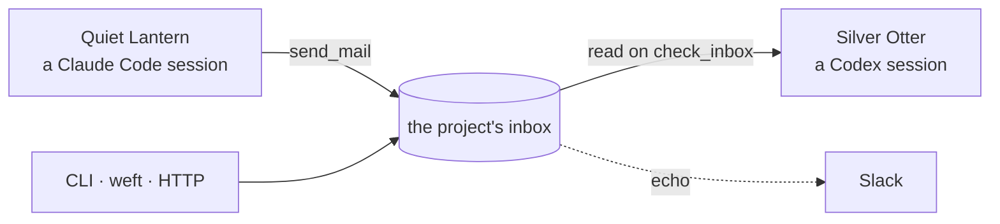

# agent-mail

Durable local mail and advisory coordination between coding-agent sessions.

You are running several coding agents at once, in different projects and
different tools. One of them finishes something another is waiting on. You
copy text from one session and paste it into another.

agent-mail is a local message bus for those sessions. A message lands in a
project's on-disk inbox (its spool) whether or not anyone is listening. A
a running session can receive it in context when its push integration is
enabled.



Sessions address each other by stable names across project directories.

- **Durable delivery.** A message waits in the project's inbox until an
  intended recipient retrieves it with `check_inbox`, unless it expires. A
  running session with push enabled can receive it automatically.
  Receipts distinguish spooled, pushed, read, held, refused, and expired mail.
- **Any endpoint.** agent-mail speaks standard MCP over stdio, so any MCP
  client can use the same tools and inboxes. Setup is tested with Claude Code
  and Codex; the CLI, an HTTP client, or a tool such as
  [weft](https://github.com/osteele/weft) reporting a finished job can send
  too.
- **Push into supported sessions.** With the corresponding channel or extension
  enabled, mail arrives in a session's context without the agent asking.
- **Advisory coordination.** Path claims keep two agents from editing the
  same files, work leases record who is responsible for a logical unit, and
  lab-notebook experiment numbers (`EXP-NNN`) allocate atomically.
- **Inspectable traffic.** Unread state, threads, Slack echo, and web and
  Slack dashboards.

Claude Code's own cross-session messaging and agent teams cover the
all-Claude, all-live, spawned-together case without any of this;
[When to use Claude Code's built-ins](#when-to-use-claude-codes-built-ins)
maps the boundary.

## Quick start

Register agent-mail with the agents you use, in one command:

```bash
npx add-mcp github:osteele/agent-mail --args mcp --name agent-mail --global \
  --agent claude-code --agent codex
```

Sessions can then send mail, read their inbox, and take claims. The command's
only effect is the config entry:
[`add-mcp`](https://github.com/neon-solutions/add-mcp) writes each agent's
config file, and `npx` fetches agent-mail when a session starts it, so there
is no repository to clone and no background process to run.

Pass `mcp` through `--args`: add-mcp does not split a quoted command string
and silently writes a broken entry.

Name any other clients the same way (`--agent cursor --agent zed`, and so on);
`npx add-mcp list-agents` lists the twenty or so it knows. Every client gets the
same tools and the same durable inbox. Channel push is specific to Claude Code
and needs [its own setup](#enabling-channel-push-in-claude-code).

`--global` writes each agent's user-level config rather than the current
project, so a session in any directory stays reachable.

Requires Node 22.18 or later. Restart existing sessions afterward.

### Send the first message

The MCP tools are enough for a complete exchange. In one registered session,
ask the agent:

> Use agent-mail to send "ping" to the project
> `/absolute/path/to/the/receiving/project`.

In a session working in that receiving project, ask:

> Check agent-mail for unread messages, then mark the ping as read.

That sends a project broadcast. To reach one session when several share the
project, use `list_sessions` to find its full name and pass that name to
`send_mail`. The target project determines which inbox stores the message; the
optional session name limits who can see it.

Generated addresses use a credited 256 × 256 subset of Glitch's
[`friendly-words`](https://github.com/glitchdotcom/friendly-words). Agent-mail
does not reuse a noun held by another registered session and normally waits 30
days before reusing a noun, so a human can usually address an established agent
by its noun alone. Names may eventually recycle; session IDs remain the durable
identity. See [ADR 0012](docs/decisions/0012-allow-friendly-session-names-to-recycle.md)
and [the third-party notice](THIRD_PARTY_NOTICES.md).

### Install only what you need

| Component | What it adds | Setup |
| --- | --- | --- |
| MCP registration | `send_mail`, `check_inbox`, session discovery, and coordination | The `npx add-mcp` command above |
| Local CLI | Shell automation, status commands, daemon management, and dashboards | `npm install -g github:osteele/agent-mail` |
| Daemon | Slack echo, fast presence status, automatic dead-session cleanup, later-arrival reminder data, and a persistent dashboard | `agent-mail install` on macOS; `agent-mail start` on Linux |
| Claude Code channel | Automatic message push into a running Claude session | Add and configure the plugin below |
| Oh My Pi extension | Automatic exact-session push plus an agent-mail address in OMP's status line | Link the bundled extension; see [Oh My Pi](docs/oh-my-pi.md) |
| Reminder hooks | Unread counts on later turns in pull-only clients | `agent-mail hooks install` |
| Web dashboard | Local read-only traffic and coordination view | Set `dashboard = true`; requires the local CLI |

### Adding the daemon on macOS

An optional daemon adds [Slack echo](#connecting-to-slack), cached presence
data that keeps the [status line](#status-lines) fast, and automatic cleanup of
dead sessions. It also supplies later-arrival reminder data and serves the
persistent dashboard when that dashboard is enabled:

```bash
npm install -g github:osteele/agent-mail
agent-mail install
agent-mail status
```

Mail is delivered with or without it: when no daemon answers, a session writes
to the project's spool itself. On macOS, the daemon runs as a launchd service.
Nothing about delivery depends on it.

`agent-mail install` also registers agent-mail with Claude Code and Codex. If
Kimi Code, Gemini CLI, or OpenCode has a user config directory, it registers
with those clients too. Running both setup paths is harmless: a matching entry
is a no-op, and an entry that points somewhere else is reported and left alone.

On Linux, the CLI and MCP server work, and `agent-mail start` starts a detached
bare-mode daemon; agent-mail does not install a Linux boot service.

**Platforms.** The CLI and MCP server are tested on macOS and Linux. The
daemon installer is macOS-only. Windows is unsupported:
session liveness is read from `ps`, and without it the registry cannot prune
sessions or expire claims. See
[docs/decisions/0005](docs/decisions/0005-no-windows-support.md).

### Enabling channel push in Claude Code

The MCP tools and the durable inbox work as soon as the server is registered.
Channel push is a separate opt-in with three parts, all of which must line up.

The marketplace lives in this repository and can be added directly from
GitHub. A clone is only needed for local development or testing.

1. **The marketplace added and the plugin installed**, which `agent-mail
   install` does not do for you:

   ```bash
   claude plugin marketplace add osteele/agent-mail
   claude plugin install agent-mail@osteele-local
   ```

2. **Channels enabled and this plugin allowed**, in managed settings
   (`/Library/Application Support/ClaudeCode/managed-settings.json`):

   ```json
   {
     "channelsEnabled": true,
     "allowedChannelPlugins": [
       { "marketplace": "osteele-local", "plugin": "agent-mail" }
     ]
   }
   ```

3. **Each session launched with the channel loaded:**

   ```bash
   claude --channels=plugin:agent-mail@osteele-local
   ```

   This is a per-launch decision, so set it once for every session instead of
   typing it each time. With a launcher wrapper, put it in global
   `extra_args`; scoping it to some paths leaves whole directories silently
   without push.

Run `agent-mail status` to see what is actually in place, and `agent-mail
listeners` to see which live sessions were launched with the channel: one whose
host was not is tagged `{channel:host-not-loaded}`.

To test from another registered agent, use the `send_mail` exchange above. If
you installed the local CLI, the equivalent shell smoke test is:

```bash
agent-mail notify --project "$PWD" --from cli --message "agent-mail is ready"
agent-mail inbox --project "$PWD"
```

`inbox` acknowledges what it returns, the way the `check_inbox` tool does: it
records a delivery receipt per message and marks them read. Pass `--peek` to
read without acknowledging. Both depend on agent-mail being able to tell which
session you are — it adopts a session id from the environment only when that
session's own agent process is an ancestor of the CLI process, so a script or
daemon cannot mark a peer's mail read by inheriting its id. When it cannot tell,
it says so on stderr and leaves the mail unread.

Sending has the mirror rule: `notify` stamps a resolvable sender identity when
it can prove one, and otherwise sends with `--from` as a free-form label. A
recipient sees such a label tagged `[label; not a reply address]`, because
replying to it by name will not resolve.

### Unread-mail reminders for pull-only clients

Every agent-mail MCP server reports an existing unread backlog in its initial
instructions. Codex, Kimi Code, and Gemini CLI have no channel push for mail
that arrives afterward, so reminder hooks close that gap: the harness runs
`agent-mail remind` on turn events, and unread counts enter the model's context
when there is mail waiting. Codex and Kimi also check once at Stop: a newly
unannounced mail edge requests one follow-up turn, while unchanged unread mail
allows the session to stop. The later-arrival reminders need the daemon, which
computes the per-session unread summary. Reminder text never includes a sender,
subject, topic, preview, or body.

```bash
agent-mail hooks install
agent-mail hooks status
```

With no flag, install covers every harness whose config directory exists;
pass `--codex`, `--kimi`, or `--gemini` to pick one. Restart the harness
sessions afterward. [docs/reminders.md](docs/reminders.md) covers the
mechanism, per-harness details, and verifying the hooks reach the model.

### Updating and restarting

Installing the package puts the `agent-mail` command on `PATH`;
`agent-mail install` is the separate step that creates the launchd service and
registers agent-mail with Claude Code and Codex, plus Kimi Code, Gemini CLI,
and OpenCode when their user config directories exist. It registers whichever
copy you ran it from, and with whichever runtime ran it, so the same command
works from an installed package and from a development checkout. `agent-mail
uninstall` unloads and removes the launchd service, then removes the audit hook
and MCP registrations that belong to this installation.

[docs/install.md](docs/install.md) covers the installer's edge cases: when an
existing entry is preserved, replaced, or left alone, and the plugin versus
user-scope registration conflict that silently discards channel pushes.

Restart every existing agent session after an integration change or an
agent-mail code update. Each session owns a long-running MCP process, so it
does not load new tool schemas or server code automatically.
Restart the daemon after changing daemon code:

```bash
agent-mail restart
```

Most daemon configuration changes can be reloaded with `agent-mail graceful`.
Changing the port requires `agent-mail restart` because the listening socket is
bound when the process starts.

## How delivery works

Claude Code, Codex, and any other MCP client load the same MCP server and use
the same tools and spools, and every sender (a session, the CLI, weft, an HTTP
client) is delivered the same way. Under the default `accept` inbound policy,
the receiving client determines how soon a message enters its context: a
Claude Code session with channel push enabled receives it unasked, and
otherwise reads it on the next `check_inbox`; a Codex session always reads on
`check_inbox`, because Codex has no channel push. A `check_inbox` call marks
the messages it returns read (pass `peek` to look without marking them);
`mark_read` covers mail handled from a channel push. Per-session `hold` and
`refuse` policies delay or suppress entry into context.
Codex's MCP tools still register the session, send mail, inspect peers, read
and mark inbox messages, and manage claims. Messages remain available in the
project spool after delivery.

## Coordination

Three primitives, all advisory, and all filesystem transactions rather than
daemon state:

- **Path claims** reserve a file or directory before you edit it. Claim a
  multi-file edit set in one call so acquisition is atomic; a directory claim
  conflicts with every claim beneath it.
- **Work leases** record which session is responsible for a logical unit, such
  as executing a research plan. A lease never blocks a file edit, and a path
  claim never implies responsibility for the plan.
- **Experiment numbers** (`EXP-NNN`) are allocated atomically against a lab
  notebook, counting both existing files and outstanding reservations.

`list_coordination` shows all three together, with owners and conditions.
`recover_coordination` releases a record after revalidating that its owning
process is dead or that a manual owner has expired. An explicit, user-supplied
`authority` can force recovery when the owner is live or cannot be verified;
agent-mail records that action in an audit log.
[docs/architecture.md](docs/architecture.md#coordination-claims) specifies the
conflict rules, recovery, and transferring a lease between live sessions.

## Configuration

`~/.config/agent-mail/config.toml` holds the port, the Slack echo and
dashboard settings, session aliases, the inbound policy, and the rate,
deduplication, and expiry limits.
[docs/configuration.md](docs/configuration.md) is the reference.

### Connecting to Slack

An incoming webhook can mirror messages into a Slack channel. Create a Slack
app and enable [Incoming
Webhooks](https://docs.slack.dev/messaging/sending-messages-using-incoming-webhooks).
Then select **Add New Webhook to Workspace**. Choose the channel that should
receive agent-mail traffic, then copy the generated webhook URL. Treat this
URL as a secret. Message Markdown is translated to Slack's `mrkdwn`, including
headings, emphasis, lists, code, and links.

Add the URL to `~/.config/agent-mail/config.toml`:

```toml
slack_webhook = "https://hooks.slack.com/services/..."
slack_echo = "all"
```

`AGENT_MAIL_SLACK_WEBHOOK` can supply the URL instead. Reload the daemon and
send a test message:

```bash
agent-mail graceful
agent-mail notify --project "$PWD" --from cli --message "Slack connection test"
```

The webhook is enough for per-message echoes. The editable Slack dashboard
also uses the Web API. Add the [`chat:write`
scope](https://docs.slack.dev/reference/scopes/chat.write/) to the Slack app,
reinstall the app in the workspace, and invite its bot to the target channel.
Copy the Bot User OAuth Token and the channel ID into the same config file:

```toml
slack_bot_token = "xoxb-..."
slack_channel = "C0123ABCD"
```

Environment-variable equivalents are `AGENT_MAIL_SLACK_BOT_TOKEN` and
`AGENT_MAIL_SLACK_CHANNEL`. Post or refresh the dashboard with:

```bash
agent-mail slack-dashboard
```

### Status lines

`agent-mail status-line` prints this session's display name, whether or not
anyone else is in the project. Agents can use the display name as an address
when it is unique in the target project; `list_sessions` also reports the full
name and session ID for unambiguous routing. The command prints the name this
session is actually registered and reachable under — see
[identity resolution](docs/status-line.md#project-and-session-resolution) for
why the two can differ. It prints nothing when it cannot resolve a session ID,
or when it cannot tell which registration in the project is its own.

`--fields` prints one tab-separated line instead: the name, peer count, unread
messages, delivery mode, and unprocessed weft jobs this session submitted. The
delivery field is `push`, `pull`, `unknown`, or empty when no registered session
can be identified. A status line can then show all five from a single
invocation, rather than reimplementing agent-mail's registry and spool
semantics in shell. Fields are only ever appended, so a consuming script can
split positionally.

#### Claude Code

It reads Claude Code's [statusLine](https://code.claude.com/docs/en/statusline)
JSON payload on stdin, taking the session ID and project directory from it. Add
it to your status line script:

```bash
#!/bin/bash
# Claude Code closes stdin when it is done, so `cat` returns. The tty check
# keeps a manual invocation from blocking.
input=""
[ -t 0 ] || input=$(cat)

cwd=$(printf '%s' "$input" | jq -r '.workspace.current_dir // .cwd // empty')

# Forward the payload already captured because stdin was consumed above.
session=""
if [ -n "$input" ] && command -v agent-mail >/dev/null 2>&1; then
    session=$(printf '%s' "$input" | agent-mail status-line 2>/dev/null)
    [ -n "$session" ] && session=" · $session"
fi

printf '%s%s\n' "${cwd/#$HOME/\~}" "$session"
```

```
~/code/agent-tools/agent-mail · Quiet Lantern
```

Then point `statusLine` at it in `~/.claude/settings.json`:

```json
{ "statusLine": { "type": "command", "command": "bash ~/.claude/statusline.sh" } }
```

#### Kimi Code

Kimi Code supports an external status-line command through `[status_line]` in
`~/.kimi-code/tui.toml`. Its native `sessionId` is not the identity registered
by the agent-mail MCP process. Launch Kimi through a wrapper that exports a
fresh `AGENT_SESSION_ID`; the MCP server and status-line command inherit that
same value. Without it, the example omits agent-mail identity and mailbox
fields instead of joining unrelated IDs.

Copy the checked-in formatter from a clone of this repository:

```bash
install -m 755 examples/status-lines/kimi.sh ~/.kimi-code/statusline.sh
```

Then configure Kimi:

```toml
[status_line]
command = "bash ~/.kimi-code/statusline.sh"
```

Run `/reload-tui` or restart Kimi. The formatter shows the agent-mail name,
delivery mode, unread messages, unprocessed weft jobs, and peers:

```
Quiet Lantern ↻ · 2 unread · 3 unprocessed · 1 peer
```

Kimi renders only the first stdout line. It caps the command at 300 ms and
falls back to its built-in footer on failure, so the example uses only one
external process.

#### Clients without an external status command

OpenCode, Codex, and Gemini can run the agent-mail MCP server, but their native
footers do not currently accept an external command or custom agent-mail field.
Gemini and Codex can show their own session identifiers; those identifiers are
not substitutes for the agent-mail display name or mailbox fields.

Codex and Gemini (and Kimi, alongside its status line) can still learn about
unread mail without polling: `agent-mail hooks install` registers a per-turn
hook that injects unread counts into the model's context.
[docs/reminders.md](docs/reminders.md) covers setup.

[docs/status-line.md](docs/status-line.md) specifies the `--fields` output and
the separate Claude Code and Kimi Code payload and rendering constraints.

## Dashboards

The read-only dashboard is off by default because it exposes every project's
session and message metadata to local processes. Both dashboard forms require
the local CLI and `dashboard = true` in
`~/.config/agent-mail/config.toml`. Run `agent-mail graceful` if the daemon is
already running so it picks up that setting. The daemon then serves the
dashboard at `http://127.0.0.1:8377/`, showing live sessions, coordination
health, sender-to-recipient traffic, and a flight log. `agent-mail dashboard
--open` opens it; when the daemon is down, the same command starts a
filesystem-backed fallback server. `agent-mail slack-dashboard` posts the same
summary into Slack and edits that message in place on later runs, which needs
the bot token rather than the webhook.
[docs/dashboards.md](docs/dashboards.md) covers both.

## Security

The daemon binds 127.0.0.1, so any process running as the local user can submit
text. All inbound mail is explicitly marked untrusted and cannot approve
permissions or override the receiving session's rules. Use `hold` or `refuse`
for sessions that should not accept agent-mail automatically, and do not expose
the port.

## When to use Claude Code's built-ins

Claude Code ships two things that overlap with agent-mail.

**[Cross-session messaging](https://code.claude.com/docs/en/cross-session-messaging)**
(`ListAgents` and `SendMessage`, Claude Code 2.1.224) sends a message to a
named, running Claude session on the same machine. It needs no daemon and no
configuration. For a direct message to a live Claude session, use it with the
name or id returned by `ListAgents`. Agent-mail display names such as `Quiet
Lantern` are a separate namespace and resolve through `list_sessions` and
`send_mail`, not native `SendMessage`.

**[Agent teams](https://code.claude.com/docs/en/agent-teams)** (experimental,
off by default) let one session spawn teammates that share a task list and
message each other through per-agent mailboxes, with file locking on task
claims. For parallel work you are launching now, under one lead, in one
project, use it.

Use agent-mail when the shape is different in one of these ways:

- **You started the sessions yourself.** Agent teams have a
  lead and teammates for the lead's lifetime, one team per session. agent-mail
  addresses peers that started independently, in their own projects, with no
  hierarchy and nothing to promote or transfer.
- **Not every endpoint is Claude Code.** Codex, Kimi Code, and Gemini CLI
  sessions use the same tools and inboxes. So do the CLI, weft, and any HTTP
  client.
- **The recipient can be offline.** Unless it expires, a project broadcast
  waits in the inbox for a future session to retrieve with `check_inbox`. A
  message addressed to a known session remains available to that same session
  ID if it disconnects and later resumes, unless it expires. A team's config is
  removed when its session ends.
- **The unit of coordination is a file or a plan, not a task.** Path
  claims express edit exclusion, work leases express who is responsible for a
  logical unit, and the two are deliberately separate.
- **The traffic is inspectable.** agent-mail keeps unread state,
  threads, and receipts, echoes to Slack, and serves dashboards.

Where Claude Code's built-ins overlap with agent-mail, they are the better
choice: they need no daemon, no channel flag, and no second inbox to reason
about. If your sessions are all Claude Code, all spawned together, and all
still running, you probably do not need this.

### Auditing native SendMessage

The transports coexist: by default a native `SendMessage` does not pass
through agent-mail, so it does not appear in the spool, Slack, or dashboards.
Install the optional audit hook with `agent-mail install --native-audit` to
record successful native `SendMessage` calls in the sender's
agent-mail log and Slack echo. Audit records are never delivered through an
agent-mail inbox, which prevents the hook from creating a second delivery or a
message loop. The hook observes all `SendMessage` calls, including subagent and
agent-team messages, and records the destination exactly as Claude supplies it.
It is added to `~/.claude/settings.json` (or `$CLAUDE_CONFIG_DIR/settings.json`)
without replacing other hooks.

## Reference

- [docs/cli.md](docs/cli.md) — every subcommand and flag. `agent-mail help`
  prints a compact version of the same listing.
- [docs/configuration.md](docs/configuration.md) — every config key.
- [docs/status-line.md](docs/status-line.md) — status-line client adapters,
  `--fields` output, and timing constraints.
- [docs/http-api.md](docs/http-api.md) — the daemon's HTTP endpoints, for
  automations that should not shell out to the CLI.
- [docs/automation.md](docs/automation.md) — the read-only machine-readable
  state outputs.
- [docs/install.md](docs/install.md) — what the installer preserves, replaces,
  and leaves alone.
- [docs/architecture.md](docs/architecture.md) — how agent-mail works
  underneath.
- [docs/decisions/](docs/decisions/README.md) — why it works that way.

## Development

Development setup, the Bun/Node runtime split, and the build are in
[DEVELOPMENT.md](DEVELOPMENT.md).
[docs/architecture.md](docs/architecture.md) covers how agent-mail works
underneath.

## Related projects

[agent-lore](https://github.com/osteele/agent-lore) is a related project:
mail carries something one session needs to tell another now, while lore is
where a session records what it worked out for whoever comes next. If you
find yourself sending the same explanation to a third agent, that is the
boundary.

Both sit in a wider set of agent infrastructure, listed at
[osteele.com/software/agent-tools](https://osteele.com/software/agent-tools).

## License

MIT. See [LICENSE](LICENSE).
