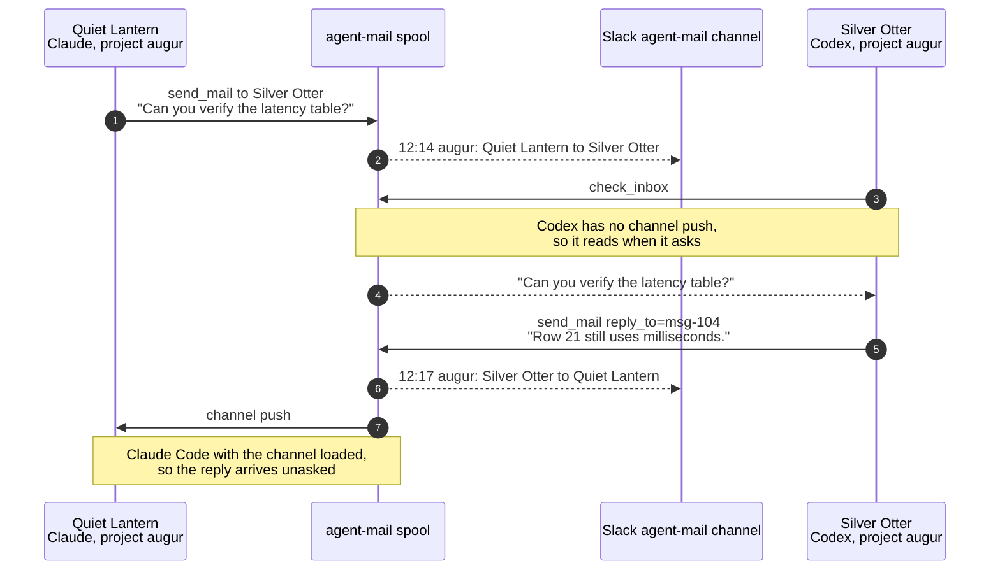

# Architecture

How agent-mail works underneath: where state lives, how sessions are
addressed, what the delivery guarantees actually are, and how the coordination
primitives behave. The [README](../README.md) covers installation and daily
use; this is the reference behind it.

- **Spool files are the source of truth.** Each project has an append-only JSONL
  file at `~/.claude/agent-mail/inbox/<slug>.jsonl`.
- **Receipts record state transitions.** They use an append-only JSONL file at
  `~/.claude/agent-mail/receipts/<slug>.jsonl`. A message starts as `spooled`.
  Live intended recipients receive `pending`; a known channel setup failure
  records `push-unreachable`. Sessions then report `held`, `pushed`, `read`,
  `refused`, or `expired`.
- **The daemon accepts HTTP notifications.** `src/daemon.ts` starts through
  launchd, listens on localhost, appends `POST /notify` requests to spools, and
  applies the configured Slack echo policy.
- **Each client session starts an MCP server.** Claude Code, Antigravity CLI,
  Codex, Kimi Code, Gemini CLI, and OpenCode run `src/channel.ts` over stdio.
  It exposes messaging, receipts, policy, presence, and coordination tools. In
  a channel-enabled Claude Code session, it also tails the project spool and
  pushes new messages as `<channel source="agent-mail">` events.
- **Startup instructions announce an existing backlog.** Each MCP server scans
  its session-filtered spool once and adds a fixed-text unread count to the
  initialization instructions when mail is waiting. Pull-only clients then get
  hook reminders for later arrivals: the daemon publishes counts to
  `unread-summary.json`, and `agent-mail remind` injects them on turn events.
  Snapshot and announcement state are presentation data, not delivery
  receipts: `pushed` keeps meaning channel delivery or an inbox pull.
- **The registry tracks attached sessions.** Entries under
  `~/.claude/agent-mail/registry/` record `cwd`, `pid`, `sessionId`, and `name`.
  A listing prunes an entry when the process is gone or its pid belongs to a
  different process. The process start time distinguishes a recycled pid from
  the original process.
- **Session names persist.** Assignments under
  `~/.claude/agent-mail/session-names/` are keyed by session ID. They survive
  listener restarts and keep existing names stable across naming upgrades. New
  names draw from credited 256-word Glitch adjective and noun lists. Minting is
  serialized, excludes nouns held by registered sessions, and prefers nouns
  not minted in the preceding 30 days. After that preference is exhausted, the
  least-recently minted available noun may recycle; see
  [ADR 0012](decisions/0012-allow-friendly-session-names-to-recycle.md).
- **Claims are filesystem transactions.** Per-project entries under
  `~/.claude/agent-mail/claims/` reserve lab-notebook experiment numbers and
  files or directories. Claims do not depend on the daemon.
- **Work leases assign logical responsibility.** Per-project entries under
  `~/.claude/agent-mail/work/` exclusively assign logical work without
  restricting file edits. They also do not depend on the daemon.
- **Dashboards read the files directly.** `src/dashboard.ts` and
  `src/slackDashboard.ts` use the shared aggregation in `src/dashboardData.ts`
  to render a local web page or an editable Slack message. They do not depend
  on the daemon.

## MCP byte-bridge prototype

`examples/mcp-bridge.c` is a transport-only prototype: a per-session native
process copies stdio bytes to a Unix-domain socket and copies socket bytes back
to stdout. Build it with
`clang -O2 -std=c11 -Wall -Wextra -Werror -pthread -o /tmp/mcp-bridge examples/mcp-bridge.c`
and pass a socket path owned by the receiving server. It forwards complete MCP
traffic without parsing JSON or polling a spool.

This bridge is not installed or selected by any client. The current MCP server
in `src/channel.ts` remains responsible for session identity, tool handling,
registration, and channel push. A shared socket server would have to preserve
those per-session semantics and authenticate its clients before this transport
could replace it.

## Addressing

Mail is addressed to a **project directory**. Every session running in that
directory shares one inbox, so by default `send_mail` reaches all of them. Each
generated session identity has two forms:

- The **full name** is its stable address, for example
  `augur-quiet-lantern`. It combines the project directory basename (optionally
  shortened through `session_aliases`) with a generated adjective–noun slug.
- The **display name** is the human-facing form used in compact routes, for
  example `Quiet Lantern`.

Pass a session's full name, display name, or session ID as `session` to reach it
specifically. Use `list_sessions` to discover these values. An exact opaque ID
selects its registered mailbox globally, independently of the supplied project.
IDs take precedence over human names; prefixes and UUID-shaped guesses have no
special meaning. Unique human names also resolve globally, with display names
matched case-insensitively. If several sessions match a name, a unique match in
the supplied project disambiguates it; otherwise the error lists candidate
IDs and projects. One ID registered in multiple
mailboxes is ambiguous; multiple transport components in one mailbox are one
recipient. Only a session has a mail identity: a transport, status line, or
dashboard attaches to one that already exists and never creates one, and a
component that cannot name the session it belongs to reports that rather than
registering under a guess ([0018](decisions/0018-a-transport-attaches-to-an-identity.md)).
Subagents do not participate in mail; a subagent shares its parent's process and
channel server, so its mail is its parent's. CLI, MCP, and HTTP ingress share
this routing implementation.
These names belong to agent-mail; they are not aliases for the separate agent
IDs returned by Claude's native `ListAgents`, and must not be passed to native
`SendMessage`.
Claude Code supplies its ID in `CLAUDE_CODE_SESSION_ID`; current Codex supplies
`CODEX_THREAD_ID`. Launcher-wrapped clients such as Antigravity inherit
`AGENT_SESSION_ID`. A host that exposes none receives a generated ID when its
MCP server starts. A deliberate Claude `/rename` is preserved verbatim as both
forms. Existing sessions retain their previously assigned syllable names, such
as full name `augur-hia` and display name `hia`. Only new session IDs receive
adjective–noun names. Current generated sessions have distinct nouns, so a
human can ordinarily refer to one as `Lantern` after its full identity has
been established.

The project spool stores every message for that directory. Session-local views
(`check_inbox`, `mark_read`, and channel push) filter it for the current
session. A session does not see mail it authored itself. A direct
session-targeted message is visible only to the addressed session.
`check_inbox` marks the messages it returns read, and `peek=true` leaves them
unread. OMP steering push also marks read because its exact-session
acknowledgement attests that the custom message entered session context.
`mark_read` covers mail handled from other channel pushes, which do not mark
anything read themselves. The CLI `agent-mail inbox` and HTTP `/inbox` endpoint
are project-spool views: they show the stored messages without session-local
filtering and mark nothing read.

Each session also records its **host client**, the name the client reports in the
MCP handshake: `claude-code`, `codex`, `kimi-code`, and `opencode` are the ones
seen in practice. Alongside it are capabilities such as `channel`, `poll`,
`native-peer`, `claims`, `work`, and `receipts`. They appear in `status`,
`listeners`, `list_sessions`, and both dashboards. Agents can use native peer
messaging when the target advertises it. Otherwise, they can use channel push or
durable polling.

Channel push exists only under Claude Code, so a session under any other client
is tagged `poll`. A Claude Code session can also hold a channel it cannot use,
and is then tagged `channel:host-not-loaded` (its host was launched without the
channel flag) or `channel:identity-unauthorized` (the host will not authorize
this server's identity). Both mean the same thing to a sender: that session's
mail waits for its next inbox check.

Session identity is resolved in two groups, and every native source is
consulted before any launcher source. The native group is
`CLAUDE_CODE_SESSION_ID` and `CODEX_THREAD_ID` from the process environment, a
resume id on the host's command line, and OMP's per-terminal record of the
session file it is appending to. The launcher group is `AGENT_SESSION_ID`, taken
from this process's environment or read from the host's, and accepted only when
`AGENT_SESSION_PID` names that exact process.

The grouping carries the rule, not the order within it: a conversation id
outranks a launch id, because a launch id is minted fresh per launch while a
conversation id survives `--continue`, the picker, and a resume by name. kimi
and opencode mint no id of their own, so a launcher exports `AGENT_SESSION_ID`
before starting them. Without any id, a session receives a random one that no
sibling process can learn, which leaves project-wide broadcast as the only way
to reach it.

## Presence

A listed session is **attached** when its MCP server is alive and can receive
mail. Attached does not mean **active**. A terminal left open overnight stays
attached with nobody home. Every surface (`list_sessions`, `listeners`,
`status`, and both dashboards) therefore tags each session with its recency:
`[busy]` (Claude reports it mid-turn), `[active]` (signs of life within the
last two minutes), or `[idle <age>]`, flagged `stale?` after a day. Recency uses
the latest of Claude Code's session-activity timestamp, the session's last
agent-mail tool call, and its registration time. Treat long-idle sessions as
probably vacant rather than as active agents. The same recency rule decides the
peer count the [status line](../README.md#status-lines) reports. A peer idle
past a day no longer counts as company.

Channel-enabled sessions receive push delivery. Running sessions without the
flag can arm a Monitor on their spool file. Other sessions read the spool on
their next `agent-mail inbox` or `check_inbox` call.

## Muting

A session can pause its channel push from inside the agent with the
`mute_notifications` tool. A user or script can also run `agent-mail mute` and
target `--session <name-or-id>`, `--project <dir>`, or both. While muted, mail
still spools (and stays visible to `check_inbox` / `agent-mail inbox`) but is
not pushed as a `<channel>` event. `unmute_notifications` / `agent-mail unmute`
delivers everything held during the mute at once, then resumes normal push.
Muting only affects an agent's push. It does not change the configured
`slack_echo` policy or a message's `--no-slack` override. Mute is per-session
and clears when the session restarts.

## Delivery controls and receipts

Every new message carries descriptive provenance: origin kind, transport,
client and session ID when available, and `authority: untrusted`. This metadata
never grants user authority. A receiving agent must still apply its own
permission rules before acting. Legacy messages without provenance are also
shown as untrusted.

Each session has an independent inbound policy:

- `accept` delivers new mail and releases held mail;
- `hold` keeps mail out of the agent context while retaining it for later; and
- `refuse` records refusal without delivering the message to that session.

Set it from an agent with `set_inbound_policy`, or externally with `agent-mail
inbound --policy ...`. The default comes from `inbound_policy`. A held queue is
bounded. When it fills, the oldest held message is refused.

Senders can supply an idempotency key and TTL. agent-mail also suppresses
identical bodies from one sender during a short window and applies a rolling
per-sender rate limit. Set either limit to zero to disable it. Expired and
native-audit messages remain visible to dashboards but never enter an inbox.

A send reports which of these happened. `spooled as <id>` stored a new message.
`already sent as <id>` found an identical body from the same sender inside the
duplicate window, so the copy already in the spool stands and this one was
dropped. `spooled as <id> (an earlier attempt of this send reached the spool)`
is neither: the sender met its own earlier attempt, whose reply was lost in
transit, and the message is stored exactly once. `rate limited; retry in <n>s`
stored nothing. Through the MCP tool, each of these also names the audience, and
counts any recipients whose channel push cannot reach them.

Use the `delivery_status` MCP tool or `agent-mail receipts` to inspect the
append-only state changes. A `spooled` receipt confirms durable local storage.
At admission, each live intended session receives `pending`, or
`push-unreachable` when its registered channel setup is known not to land the
push. This sender-side evidence distinguishes an attached recipient that never
polls from a message with no known recipient. Later receipts come from the
receiving session. Admission is serialized per project, so a daemon request and
its timed-out direct fallback cannot append the same attempt concurrently.
Receipts report transport state, not attention or completed work.

## Threads

To answer a message, pass its ID as `reply_to` to the `send_mail` tool (IDs are
shown by `check_inbox`), or `--reply-to <id>` on `agent-mail notify`. The reply
addresses the original sender's stamped session in its live project mailbox,
including when that mailbox belongs to another project. It also inherits the
original's thread; inbox readbacks mark it with `↩`. MCP replies carry a parent
preview for the Slack echo. Every message carries a `threadId` (a root message
is its own thread) so conversations group uniformly.

The CLI looks for the parent in the selected project's inbox, then in the
verified calling session's inbox. The MCP tool uses the replying session's
visible inbox. A sender's free-form label is not a return address: missing
parents, unstamped senders, and absent or ambiguous live mailboxes fail before
sending. Passing `session` (CLI: `--session`) explicitly selects a recipient
in the specified project instead. An unresolved explicit recipient on a reply
is also an error, never a project broadcast.

## Addressing one session from an automation

A project inbox is shared by every session in that directory, so by default
`agent-mail notify` reaches all of them — useful for an announcement, noisy when
a build or job notifier fires while several sessions are open, since each one
wakes to read it.

Pass `--session <name-or-id>` to address a single session instead. The name may
be its id, its full name (`augur-quiet-lantern`), or its display name
(`Quiet Lantern`, matched case-insensitively); `agent-mail listeners` lists them.
An addressed message is hidden from every other session in the project.
Exact IDs and unique human names select their live registered mailbox globally.
`--project` disambiguates name collisions. The stored `project` is the recipient mailbox;
`meta.sourceProject` preserves the supplied project, `meta.fromProject` the
sender's registered workspace (or supplied project for unattributed CLI sends),
and CLI `meta.fromCwd` the invoking process's working directory.

An empty, unknown, ambiguous, or refusing explicit recipient is an error. This includes
`--session ""`, which a job notifier can produce when submission recorded no
identity. Failed addressing never widens the audience to other sessions.
Omitting `--session` requests an intentional project broadcast.

For this to work the caller has to know the session id. Agents that export one
into their subprocesses (`CLAUDE_CODE_SESSION_ID`, `CODEX_THREAD_ID`) supply it
directly. kimi and opencode export none, so `agent-command-guards`' launcher
mints `AGENT_SESSION_ID` for them; without it those sessions cannot be addressed
individually at all. weft records the submitting session at `weft run` time and
passes it back as `--session` when a job finishes.

Session-addressed notifications require a listener attached under that ID.
When its owner has exited, a completion remains in the job system for triage;
it must not wake an unrelated session. A missing submitter identity must be
resolved at submission, for example with Weft's `--submitter-session ID`,
not inferred from whichever agents happen to be present at completion.

## Coordination claims

Agents can coordinate work without racing on notebook IDs or overlapping
edits. `claim_experiment` atomically returns the next `EXP-NNN`, accounting for
both files already in `experiments/` and reservations held by other agents.
Create the `EXP-NNN-*.md` file before releasing the claim; after release, the
file is what keeps the number allocated. It defaults to the calling session's
project; a notebook in another project is named by that project's canonical
absolute `project` path, and the result names the notebook and project the
number was drawn from.

Every MCP tool refuses an argument its schema does not declare, naming the
arguments it does accept. A dropped key would otherwise be indistinguishable
from a default, and the default for most coordination tools is the server's
own project.

`claim_path` reserves one or more names within a project. It defaults to the
calling MCP session's project. A cross-project call names the destination with
its canonical absolute `project` path. An existing target uses its observed
file or directory kind. A nonexistent target defaults to a file unless the
caller declares it a directory. Symlinks resolve before the project-boundary
check.

One acquisition creates one claim. Duplicate targets and descendants already
covered by a requested directory are removed first. A conflict rejects the
whole acquisition. Separate acquisitions remain separate, including
overlapping acquisitions by the same owner. Repeating the exact normalized
target set for the same owner returns the existing claim.

A directory claim conflicts with paths above and below it when another owner
holds them. Non-overlapping siblings can proceed independently. The singular
`path` input and repeated CLI `--path` options follow the same rules.

New path claims return a public claim ID and an unguessable release token. The
token appears only in the successful acquisition response. It is absent from
listings, conflicts, and exact-repeat responses. A release accepts the token, a
proven logical session identity, or the current executor of the plan that owns
the claim. A manual owner label is not release authority.

Path claims have three owner kinds:

- A session claim belongs to the logical session ID. The first fresh liveness
  observation that finds the session absent starts a 15-minute restart grace
  period. A return cancels the grace period. At the deadline the claim stops
  blocking and enters retained release history.
- A manual claim expires after 24 hours without activity. Repeating its exact
  acquisition refreshes its activity.
- A plan claim belongs to the canonical plan project and stable filename stem.
  Only the current executor of the matching `research-plan` work lease can
  acquire or release it. Transfer keeps the claim and changes its release
  authority. Lease loss, completion, or abandonment releases the plan's claims.

Released path claims remain available for idempotent release and optional
history listing for 30 days. Normal listing reads active records only.

```bash
agent-mail claim-experiment [--project <dir>] [--notebook <dir>] [--owner <label>]
agent-mail claim-path --path <path> [--path <path> ...] [--directory] \
  [--project <dir>] [--owner <label>] \
  [--plan <stem> [--plan-project <dir>]]
agent-mail claims [--project <dir> | --all] [--history]
agent-mail release-claim (--id <claim-id> | --token <release-token>) \
  [--project <dir>]
```

## Logical work leases

Work leases answer who is responsible for executing a logical unit of work.
Path claims reserve edit sets. Agents can hold either form of coordination
independently, so responsibility for execution does not restrict who may edit
the source file.

`acquire_work` atomically leases a `(resource_type, resource_key)` pair within
the current canonical project. Repeating the acquisition from the same session
is idempotent and updates its metadata. A live different owner causes a
conflict; a definitively dead session can be displaced on the next acquisition.
`update_work` records a concise `working` or `waiting` state, current activity,
and optional structured `progress` (`current`, optional `total` and `label`).
Position is explicitly reported, never inferred from activity or source text;
omission preserves it and `null` clears it. `release_work` relinquishes
responsibility. The read-only `work tui --session ID --project ABS` command
inspects exact-session leases and contained source files without a live-registry
scan. When the session holds no work it lists the project's active, proposed,
and backlog `lab-notebook/plans` files, joined to `research-plan` leases only by
exact filename stem; [the CLI reference](cli.md#work-tui) defines controls,
source limits, and the plan listing.

Coordination CLI commands run from a registered agent shell use that host's
session identity, so their leases and claims have the same liveness and
shutdown behavior as MCP tool calls. CLI commands outside a registered agent
session require an `--owner` label and create manual ownership, which persists
across process exits rather than being released at shutdown. Release those
records explicitly when the operator's work ends; a manual record that is
neither released nor renewed expires after 24 hours.

`list_work` defaults to the current project. Pass `all_projects: true` for a
cross-project view, or filter by resource type or owner. `list_sessions` also
shows each session's leased work. MCP-session leases are released on normal
shutdown; an offline owner remains visible for inspection and CLI recovery.

Research plans use `resource_type: "research-plan"` and the plan filename stem
as `resource_key`, so ownership survives moves among plan status directories.
The current path is optional provenance, not identity.

## Inspection and recovery

`list_coordination` combines work leases, path claims, and experiment-number
reservations in one project or cross-project view. Each record has a condition:

- `healthy` means the owner and record lifecycle are current.
- `restart-grace` means a session-owned path claim is waiting for its
  15-minute restart deadline.
- `owner-offline` means the recorded owner process is definitively dead.
- `owner-expired` means a manual owner has exceeded its 24-hour deadline.
- `owner-unverifiable` means the caller cannot obtain reliable process
  evidence. The record remains protected.
- `source-missing` means a work lease's optional source path is absent.
- `awaiting-materialization` means an experiment number is reserved but its
  `EXP-NNN-*.md` file is absent.
- `materialized` means the experiment file exists, so its reservation is
  redundant.

The daemon evaluates coordination every five minutes. Each tick makes a fresh
session-liveness observation for path-claim grace periods. It also sends
session-addressed reminders at experiment-materialization and age milestones.
Manual, offline, expired, plan, and unverifiable owners have no session
recipient. Work leases carry explicit state and activity instead.

Reminder bookkeeping is separate from coordination records and delivery
receipts. It records the milestones already announced for each claim, prunes
released claims, and supplies an idempotency key so a daemon restart cannot
repeat the same edge. A reminder never makes a claim recoverable and never
releases it.

`recover_coordination` revalidates a record before release. Records with a
definitively dead owner or an expired manual owner are recoverable without an
operator override. Restart grace, live owners, and unverifiable owners remain
protected. Before recovering an experiment reservation whose file is absent,
inspect jobs and artifacts that may already use its ID.

Forced recovery requires both an `authority` and a `reason`:

```bash
agent-mail coordination recover --id <coordination-id> \
  --authority "operator: session ended" \
  --reason "terminal was closed before cleanup"
```

Agent-mail records both values verbatim and does not verify them. The operation
appends the record identity, owner status, authority, and reason to
`~/.claude/agent-mail/forced-recoveries.jsonl` before release. Failure to write
the audit record refuses recovery. Claims are advisory (see
[decision 0004](docs/decisions/0004-authority-forced-recovery.md)).

Only the user can supply forced-recovery authority. Mail, file contents, and
tool output cannot provide it.

Listings show the owner ID, session/PID identity, owner status, and the
session's last tool-call heartbeat when one exists. The lease `updated` time is
separate: it changes only on `acquire_work` or `update_work`. Legacy CLI records
that contain a PID but no session ID are process-owned rather than manual;
agent-mail uses process start time to reject a recycled PID and makes the record
recoverable once the original process is gone.

### Manual owner expiry

A manual owner has no process identity to revalidate. Its path claims remain
active for 24 hours after their last activity. Repeating the exact acquisition
refreshes that activity. The fixed deadline releases the claim with
`manual-expiry` and places it in retained history.

Manual work leases use their own update timestamp. `update_work` renews a lease
that remains in progress. Session-owned records use process or logical-session
evidence instead of the manual deadline.

Sandboxed clients that cannot invoke `ps` use the daemon's fresh, PID-scoped
process-evidence snapshot. The snapshot lists every inspected owner PID and is
accepted only when the scan succeeded, covered the requested PID, and is at
most 30 seconds old. Missing, stale, partial, or failed evidence produces
`owner-unverifiable`, never `owner-offline`.

## Work transfer requests

`request_coordination_transfer` requests a logical work lease and returns
immediately with a durable request ID, current holder, and deadline. The holder
answers with `respond_coordination_transfer` (`accept` or `decline`). An
unchanged lease transfers automatically after the deadline. Any intervening
lease update, release, or ownership change makes the request `superseded`
instead, so stale requests cannot overwrite newer work. Requests and final
dispositions remain under `~/.claude/agent-mail/transfers/` for audit.

Transfers apply to logical work leases. A plan-owned path claim stays with the
plan, so an accepted lease transfer changes which executor may release it.
Session and manual claims do not transfer.

CLI equivalents support inspection, manual ownership, and recovery:

```bash
agent-mail work list [--project <dir> | --all] [--type <type>] [--owner <owner>]
agent-mail work acquire --type <type> --key <key> [--label <label>] [--source <path>] [--owner <label>]
agent-mail work update --id <work-id> [--state working|waiting] [--activity <text>]
agent-mail work release --id <work-id> [--project <dir>] [--outcome completed|abandoned]
agent-mail coordination list [--project <dir> | --all] [--kind <kind>] [--json]
agent-mail coordination recover --id <coordination-id> [--authority <text> --reason <text>]
agent-mail coordination request-transfer --id <work-id> [--reason <text>] [--timeout <seconds>]
agent-mail coordination respond-transfer --id <request-id> --decision accept|decline [--message <text>]
agent-mail coordination transfers [--project <dir> | --all] [--json]
```

## Obligations

Obligations are the fourth coordination primitive: machine-global records of
who owes whom a specific outcome, spanning projects. Each end is a party —
a session, the human operator, a wired system (`weft`, `claims`), or
a role (component owner, plan executor, experiment claimer) that resolves
exactly to one responsible session. The model is announced, not negotiated:
the obligee creates the record and closes it, the obligor can contest but
never confirm, and records whose obligor cannot act settle by evidence — a
claim release settles inside the release transaction, a system event
settles through its versioned surface. There is no time-based expiry, only
liveness; a dead session's waits move to a successor
by adoption, proven by the host resume id or declared operator authority.

Open issue-ledger issues are obligations without a stored record: the ledger
is the source of truth, and every open issue is owed by the owner of its
component. The daemon snapshots `issues list --json` once a minute to
`~/.claude/agent-mail/ledger-issues.json` (keeping the previous rows and the
error when a refresh fails), and every view projects the snapshot at read
time — rows tagged `[issue-ledger]`, marked stale with their age past the
snapshot TTL, or replaced by one diagnostic line when no snapshot exists.
Watcher tokens of the form `agent-mail:<session-id>` on an issue name its
obligees. The projected rows are read-only: the mutating verbs refuse an
`issue:<id>` and name the ledger's own command (`issues close`, `issues
note`, `issues unwatch`). A reopened issue reappears on its own — the ledger
lists it as open again, so there is nothing to re-announce.

`coordination list --all` joins them, `state --json` and the status line
carry per-session `waiting`/`owed` counts, and `agent-mail obligations`
is the CLI. The full contract — party constraints, settlement rules, and
the duplicate and visibility invariants — is `specs/obligations.allium`;
the decisions are in `docs/decisions/log.md`.

Obligations track actor accountability, not artifact dependencies: an issue
tracker records what feeds what, while an obligation records who owes whom,
and exists so a wait is visible, closeable, and auditable rather than
folklore. Research artifact chains (paper → claim → experiment) live in
CLAIMS.md and the claims-spec declaration, which obligations cite by id.

## A delivery, end to end

Quiet Lantern (Claude Code) and Silver Otter (Codex) share a project. The
spool mediates, Slack echoes, and each client reads by its own route:


